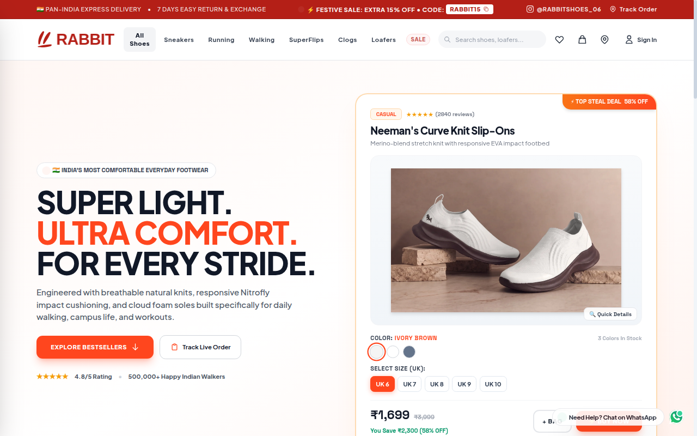
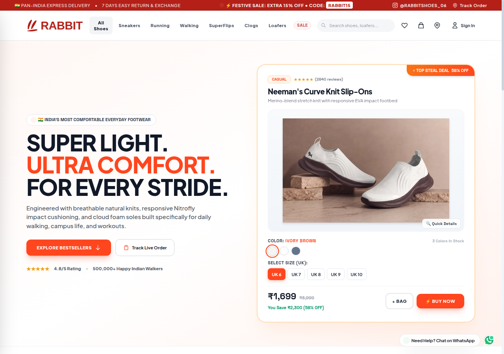
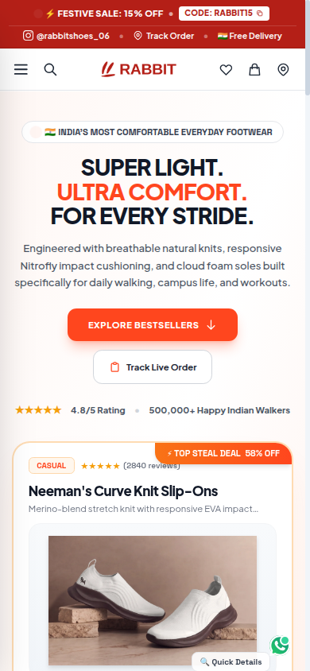
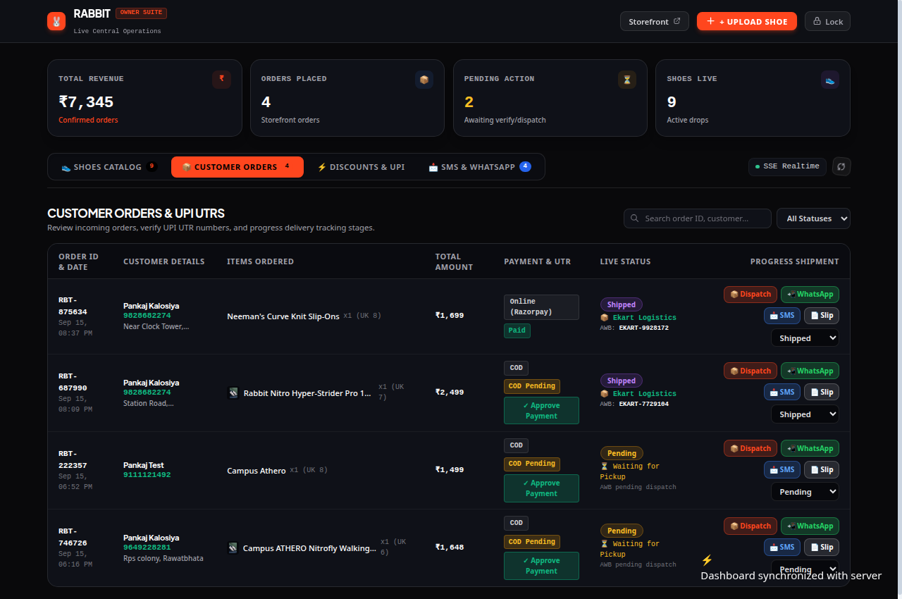
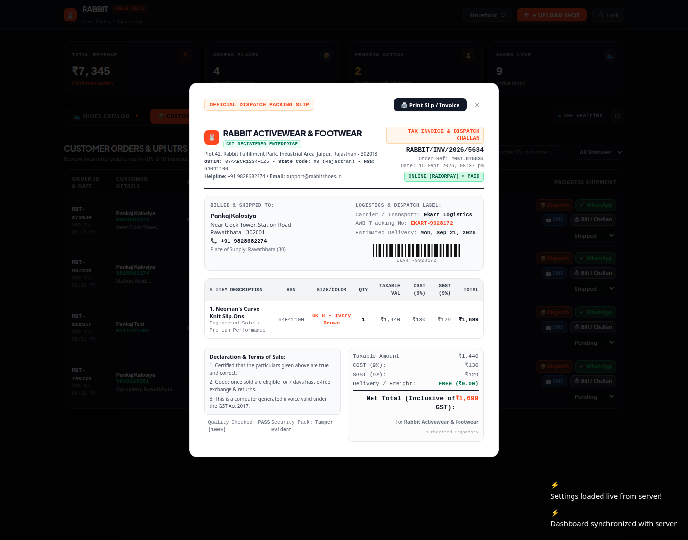

<div align="center">

# 👟 Rabbit Shoes: Production E-Commerce Storefront & Merchant Operations Suite

**Full-Featured Retail Footwear E-Commerce Platform with WhatsApp Checkout, Real-Time Admin ERP & Automated GST Invoicing**

[](https://nodejs.org)
[](https://expressjs.com)
[](https://docker.com)
[](https://nginx.org)
[](LICENSE)

<br/>

[](https://shoes.137.23.47.199.sslip.io)
[](https://themusafirr.github.io/rabbit-shoes-ecommerce-suite/)
[](https://t.me/the_musafir)

<br/>

[⭐ Star This Repo](https://github.com/themusafirr/rabbit-shoes-ecommerce-suite) • [🌐 Live Store](https://shoes.137.23.47.199.sslip.io) • [📱 GitHub Demo](https://themusafirr.github.io/rabbit-shoes-ecommerce-suite/) • [💬 Contact Developer](https://t.me/the_musafir)

<br/><br/>



</div>

---

## ⚡ Overview

**Rabbit Shoes** is a commercial-grade, end-to-end e-commerce software solution custom-built for modern retail businesses and footwear brands.

It combines an ultra-fast client-facing digital storefront with an all-in-one merchant administration panel featuring real-time inventory tracking, multi-variant sizing matrices, dynamic discount rules, automated GST-compliant tax invoices, and instant 1-tap WhatsApp checkout orders.

---

## 📸 Interface Preview

<div align="center">

### 🖥️ Customer Digital Storefront


<br/><br/>

### 📱 Responsive Mobile Experience & 🛒 Instant Checkout
<p float="left">
  
  
</p>

<br/>

### 📊 Merchant Admin Dashboard & 🧾 Automated GST Invoice
<p float="left">
  
  
</p>

</div>

---

## ✨ Core System Capabilities

### 1. 🛍️ Digital Storefront (`index.html`)
- **Interactive Product Catalog:** Category filtering (Sneakers, Running, Formal, Sports, Casual).
- **Dynamic Size & Color Selector:** Real-time stock status based on selected size variant (UK 6 to UK 11).
- **Product Quick-View Modal:** Instant previews with zoomable galleries, sizing guides, and specifications.
- **Direct 1-Click WhatsApp Ordering:** Automatically generates formatted WhatsApp messages pre-filled with order items, selected size, customer delivery address, and total price.
- **Online Checkout Integration:** Seamlessly supports UPI, Cards, and Net Banking options.

### 2. 🛠️ Merchant Operations & Admin Portal (`admin.html`)
- **Live Orders Pipeline:** Filter orders by status (New, Processing, Dispatched, Delivered, Cancelled).
- **Product & Stock Manager:** Instant price adjustments, promotional banner updates, and out-of-stock toggles.
- **Discount & Coupon Engine:** Flat off, percentage discount codes, and flash sale countdown timers.
- **Customer CRM & SMS Notifications:** Automated order confirmation alerts and delivery status updates.

### 3. 🧾 Automated GST Invoicing Engine (`invoice.html`)
- **Compliant Tax Documentation:** Auto-calculates CGST (9%) and SGST (9%) or IGST (18%) based on state origin.
- **Print & PDF Export:** Clean print-ready invoice layout with merchant GSTIN, HSN codes, and unique invoice numbering.

---

## 🏗️ Architecture & Stack

- **Frontend:** Vanilla HTML5, Modern CSS3 (CSS Grid & Flexbox, Campus/Nike-inspired styling), Vanilla JavaScript ES6+.
- **Backend:** Node.js, Express.js REST API (`server.js`).
- **Data Persistence:** JSON-based state store with atomic file writes for zero-downtime reliability.
- **Deployment:** Containerized with `Dockerfile` and `docker-compose.yml`, fronted with Nginx reverse proxy.

---

## 🚀 Getting Started

### Prerequisites
- Node.js 18+
- npm

### Installation
```bash
git clone https://github.com/themusafirr/rabbit-shoes-ecommerce-suite.git
cd rabbit-shoes-ecommerce-suite
npm install
node server.js
```

### Running with Docker Compose
```bash
docker-compose up -d --build
```
The application will be accessible at `http://localhost:3000`.

---

## 👨‍💻 Author & Commercial Inquiries

**Pankaj Kalosiya (@themusafirr)**  
- 💼 GitHub: [github.com/themusafirr](https://github.com/themusafirr)  
- 💬 Telegram: [@the_musafir](https://t.me/the_musafir)  
- 📸 Instagram: [@the.musafirrr__](https://instagram.com/the.musafirrr__)  
- 📧 Email: [musafir.developer@gmail.com](mailto:musafir.developer@gmail.com)  

---

## ⭐ Show Your Support

If you like this project or find it useful as an e-commerce template, please give it a **Star ⭐**!
